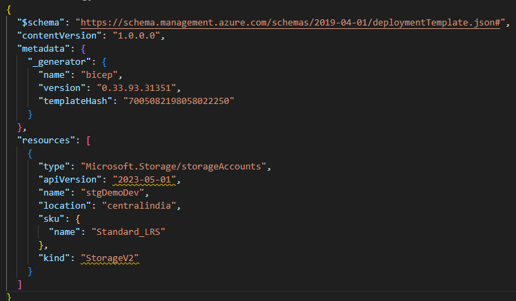




# Introduction to Infrastructure as Code (IaC)

**Infrastructure as Code (IaC)** is the practice of managing and provisioning infrastructure through machine-readable configuration files, rather than through manual processes. It enables automation, consistency, and scalability in infrastructure management.

## Why IaC?
Traditional infrastructure provisioning involves manually configuring servers, networks, and storage, which is time-consuming, error-prone, and difficult to scale. IaC solves these challenges by treating infrastructure as software code.

## Key Benefits of IaC:
1. **Automation** – Eliminates manual intervention, reducing human errors.
2. **Consistency** – Ensures infrastructure is configured the same way across environments.
3. **Scalability** – Easily replicate and scale infrastructure as needed.
4. **Version Control** – Tracks changes, enabling rollback and auditing.
5. **Cost Efficiency** – Reduces operational overhead by automating infrastructure management.

## Types of IaC Approaches:
1. **Declarative (What to achieve)** – Defines the desired state of the infrastructure, and the tool ensures it matches. Examples: Terraform, Azure Bicep.
2. **Imperative (How to achieve it)** – Defines step-by-step instructions to configure infrastructure. Examples: Ansible, scripts (Bash, PowerShell).

## Popular IaC Tools:
- **Terraform** – Open-source, cloud-agnostic IaC tool for provisioning and managing infrastructure.
- **Azure Bicep** – A domain-specific language (DSL) for deploying resources in Azure.
- **AWS CloudFormation** – Manages AWS infrastructure using JSON/YAML templates.


## Introduction to Azure Bicep

**Azure Bicep** is a domain-specific language (DSL) developed by Microsoft for deploying Azure resources declaratively. It is designed as an alternative to JSON-based ARM templates, providing a more readable and maintainable syntax.

### Why Use Azure Bicep?
1. **Simplified Syntax** – More concise and readable than ARM templates.
2. **Improved Modularity** – Supports reusable modules for better maintainability.
3. **Better Tooling** – Integrated with Visual Studio Code and Azure CLI for enhanced developer experience.
4. **Automatic Conversion** – Can decompile existing ARM templates into Bicep code.
5. **No JSON Complexity** – Eliminates the need for complex and verbose JSON structures.

### Key Features of Azure Bicep
- **Declarative and Idempotent** – Defines infrastructure as code, ensuring consistent deployments.
- **Reusable Modules** – Supports modular development for large-scale environments.
- **Native Azure Integration** – Works seamlessly with Azure Resource Manager (ARM) and Azure DevOps.
- **Simplified Parameterization** – Enables flexible and reusable configurations.


## Azure Bicep vs. ARM Templates

### Azure Bicep vs. ARM Templates  

| Feature        | Azure Bicep | ARM Templates |
|---------------|------------|--------------|
| Syntax        | Simple, readable | Complex JSON |
| Modularity    | Supports reusable modules | No native modularity |
| Tooling       | VS Code, Azure CLI | Native Azure support |
| Conversion    | Can decompile ARM to Bicep | No direct conversion to Bicep |


### **Which One to Choose?**
- **Use Azure Bicep** if you want a simplified, modular, and maintainable approach to Azure resource deployment.
- **Use ARM Templates** if you need JSON-based definitions for legacy or existing automation processes.


### **1. Install Azure CLI**
Azure CLI is required to deploy Bicep files.

### Link : https://learn.microsoft.com/en-us/cli/azure/install-azure-cli#install


### Common Structure of an Azure Bicep File
Over this example, for creating an Azure Storage Account using bicep

### Bicep deployment
You can view the JSON template you submitted to Resource Manager by using the bicep build command. In the next example, a Bicep template is converted into its corresponding JSON template
### Convert Bicep to JSON  
Run the following command:  
```sh
az bicep build --file .\001\001_stg.bicep
```
Screenshot:
The screenshot shows the JSON output generated from the Bicep file, confirming that the conversion process has executed successfully.



