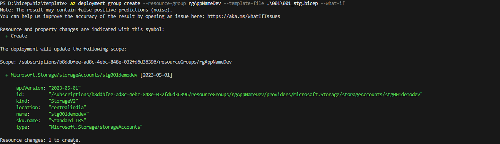
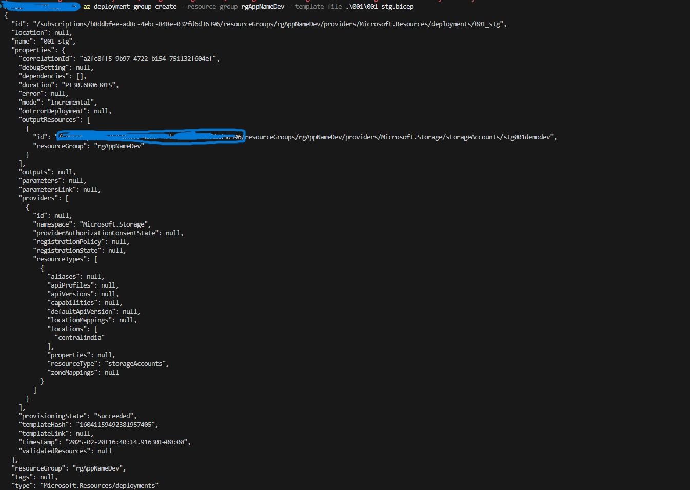
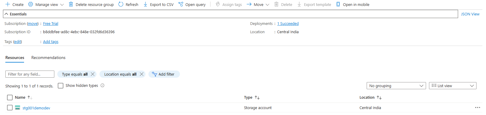
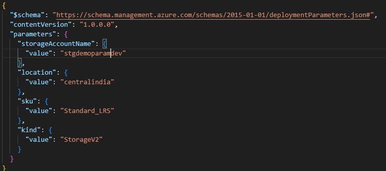

# Introduction to Infrastructure as Code (IaC)

**Infrastructure as Code (IaC)** is the practice of managing and provisioning infrastructure through machine-readable configuration files, rather than through manual processes. It enables automation, consistency, and scalability in infrastructure management.

## Why IaC?
Traditional infrastructure provisioning involves manually configuring servers, networks, and storage, which is time-consuming, error-prone, and difficult to scale. IaC solves these challenges by treating infrastructure as software code.

## Key Benefits of IaC:
1. **Automation** – Eliminates manual intervention, reducing human errors.
2. **Consistency** – Ensures infrastructure is configured the same way across environments.
3. **Scalability** – Easily replicate and scale infrastructure as needed.
4. **Version Control** – Tracks changes, enabling rollback and auditing.
5. **Cost Efficiency** – Reduces operational overhead by automating infrastructure management.

## Types of IaC Approaches:
1. **Declarative (What to achieve)** – Defines the desired state of the infrastructure, and the tool ensures it matches. Examples: Terraform, Azure Bicep.
2. **Imperative (How to achieve it)** – Defines step-by-step instructions to configure infrastructure. Examples: Ansible, scripts (Bash, PowerShell).

## Popular IaC Tools:
- **Terraform** – Open-source, cloud-agnostic IaC tool for provisioning and managing infrastructure.
- **Azure Bicep** – A domain-specific language (DSL) for deploying resources in Azure.
- **AWS CloudFormation** – Manages AWS infrastructure using JSON/YAML templates.


## Introduction to Azure Bicep

**Azure Bicep** is a domain-specific language (DSL) developed by Microsoft for deploying Azure resources declaratively. It is designed as an alternative to JSON-based ARM templates, providing a more readable and maintainable syntax.

### Why Use Azure Bicep?
1. **Simplified Syntax** – More concise and readable than ARM templates.
2. **Improved Modularity** – Supports reusable modules for better maintainability.
3. **Better Tooling** – Integrated with Visual Studio Code and Azure CLI for enhanced developer experience.
4. **Automatic Conversion** – Can decompile existing ARM templates into Bicep code.
5. **No JSON Complexity** – Eliminates the need for complex and verbose JSON structures.

### Key Features of Azure Bicep
- **Declarative and Idempotent** – Defines infrastructure as code, ensuring consistent deployments.
- **Reusable Modules** – Supports modular development for large-scale environments.
- **Native Azure Integration** – Works seamlessly with Azure Resource Manager (ARM) and Azure DevOps.
- **Simplified Parameterization** – Enables flexible and reusable configurations.


### Azure Bicep vs. ARM Templates  

| Feature        | Azure Bicep | ARM Templates |
|---------------|------------|--------------|
| Syntax        | Simple, readable | Complex JSON |
| Modularity    | Supports reusable modules | No native modularity |
| Tooling       | VS Code, Azure CLI | Native Azure support |
| Conversion    | Can decompile ARM to Bicep | No direct conversion to Bicep |


### **Which One to Choose?**
- **Use Azure Bicep** if you want a simplified, modular, and maintainable approach to Azure resource deployment.
- **Use ARM Templates** if you need JSON-based definitions for legacy or existing automation processes.


### **1. Install Azure CLI**
Azure CLI is required to deploy Bicep files.

### Link : https://learn.microsoft.com/en-us/cli/azure/install-azure-cli#install


### Common Structure of an Azure Bicep File
Over this example, for creating an Azure Storage Account using bicep

### Bicep deployment
You can view the JSON template you submitted to Resource Manager by using the bicep build command. In the next example, a Bicep template is converted into its corresponding JSON template
### Convert Bicep to JSON  
Run the following command:  
```sh
az bicep build --file .\001\001_stg.bicep
```
Screenshot:
The screenshot shows the JSON output generated from the Bicep file, confirming that the conversion process has executed successfully.


### Preview Before Deployment
The bicep what-if command is used to preview the changes that will be made to an Azure resource group before deploying a Bicep file. It provides a detailed summary of which resources will be created, modified, or deleted without actually making any changes.

```sh
az deployment group create --resource-group rgAppNameDev --template-file .\001\001_stg.bicep --what-if
```
Screensort:



### Deploy First Bicep Templaye 

#### Using Az Cli

```sh
az deployment group create --resource-group rgAppNameDev --template-file .\001\001_stg.bicep
```

Post Deployment:




### Bicep Parameter
Bicep parameters (param) allow you to pass values into a Bicep template, making it more reusable and configurable. Parameters help define inputs such as resource names, locations, or sizes, which can be provided at deployment time.

#### Defining Bicep Parameter with Annotations
```sh
@description('The unique name for the storage account.')
@minLength(3)
@maxLength(24)
param storageAccountName string

@description('The Azure region where the storage account will be deployed.')
@allowed(['eastus', 'westus', 'centralindia'])
param location string

@description('The SKU of the storage account.')
@allowed(['Standard_LRS', 'Standard_GRS', 'Premium_LRS'])
param sku string

@description('The kind of storage account.')
@allowed(['StorageV2', 'BlobStorage', 'FileStorage'])
param kind string
```

#### Bicep Parameter Decorators

| Decorator       | Description |
|----------------|-------------|
| `@description('...')` | Adds a description for documentation purposes. |
| `@allowed([...])` | Restricts the parameter to specific values. |
| `@minLength(n)` | Ensures a minimum length for a string or array parameter. |
| `@maxLength(n)` | Ensures a maximum length for a string or array parameter. |
| `@minValue(n)` | Sets a minimum value for an integer parameter. |
| `@maxValue(n)` | Sets a maximum value for an integer parameter. |
| `@secure()` | Marks a parameter as sensitive, ensuring its value isn't logged or stored in deployment history. |


#### Parameters Files
Here’s a generated parameter file (parameters.json) for your Bicep deployment



#### Deploy Infra with Parameter file
```sh
az deployment group create --resource-group rgAppNameDev --template-file 001/001_stg_param.bicep --parameters "001/001_stg_param.parameters.json"
```

### Output in Bicep
In Bicep, the output keyword is used to return values from a deployment. These values can be used by other scripts, referenced in deployment pipelines, or checked after deployment.

#### Basic Syntax 
```sh
output <outputName> <dataType> = <value>
```


#### Checkout the code for 
see bicepfile [here](../template/001/001_stg_param.bicep)

### Bicep modules
Bicep modules are reusable Bicep files that help organize, reuse, and simplify infrastructure-as-code (IaC) deployments. They allow you to break down complex deployments into smaller, manageable components.

#### Using Bicep Modules

#### Why Use Bicep Modules?

✅ **Code Reusability** – Define once, use multiple times.  
✅ **Better Organization** – Break large templates into smaller files.  
✅ **Improved Maintainability** – Modify modules independently.  
✅ **Encapsulation** – Hide implementation details while exposing required parameters.  

---

#### Example: Using Bicep Modules

#### 1. Define a Bicep Module
Create a Bicep module file (`storage.bicep`) that defines a storage account:

```bicep
param storageAccountName string
param location string = resourceGroup().location
param sku string = 'Standard_LRS'

resource storage 'Microsoft.Storage/storageAccounts@2023-01-01' = {
  name: storageAccountName
  location: location
  kind: 'StorageV2'
  sku: {
    name: sku
  }
}

output storageId string = storage.id
```

#### 2. Use the Module in a Main Bicep File
Reference the module in your main Bicep file (`main.bicep`):

```bicep
param storageAccountName string
param location string = resourceGroup().location

module storageModule './storage.bicep' = {
  name: 'storageDeployment'
  params: {
    storageAccountName: storageAccountName
    location: location
  }
}
```

#### 3. Deploy Using Azure CLI
Run the following command to deploy the Bicep template:

```sh
az deployment group create --resource-group <ResourceGroupName> --template-file main.bicep --parameters storageAccountName=<YourStorageAccount>
```

---

#### Benefits of Using Modules
- **Simplifies complex deployments** by breaking them into smaller, manageable components.
- **Enhances collaboration** by allowing teams to work on separate modules.
- **Easier troubleshooting** since each module can be tested independently.
- **Improves security** by exposing only necessary parameters while keeping implementation details hidden.

By structuring your Bicep templates into reusable modules, you enhance scalability, maintainability, and clarity in your infrastructure as code (IaC) deployments. 🚀


